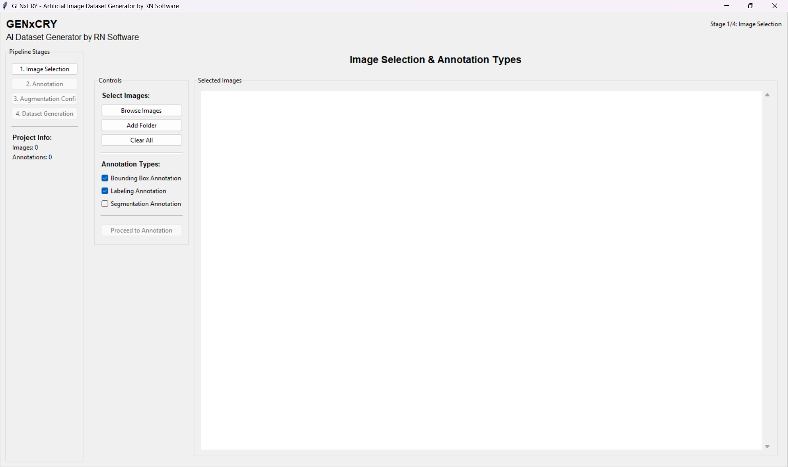
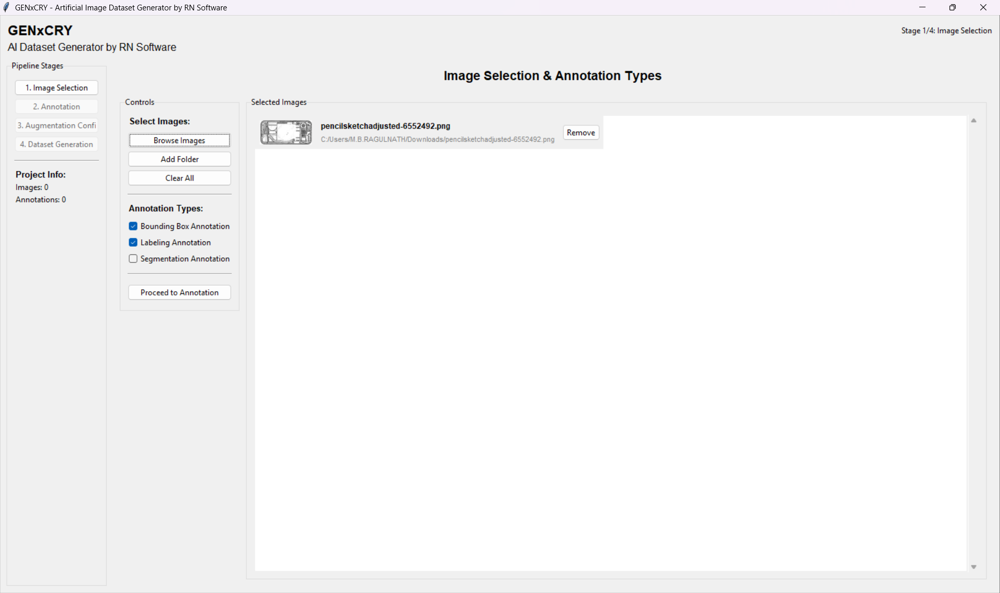
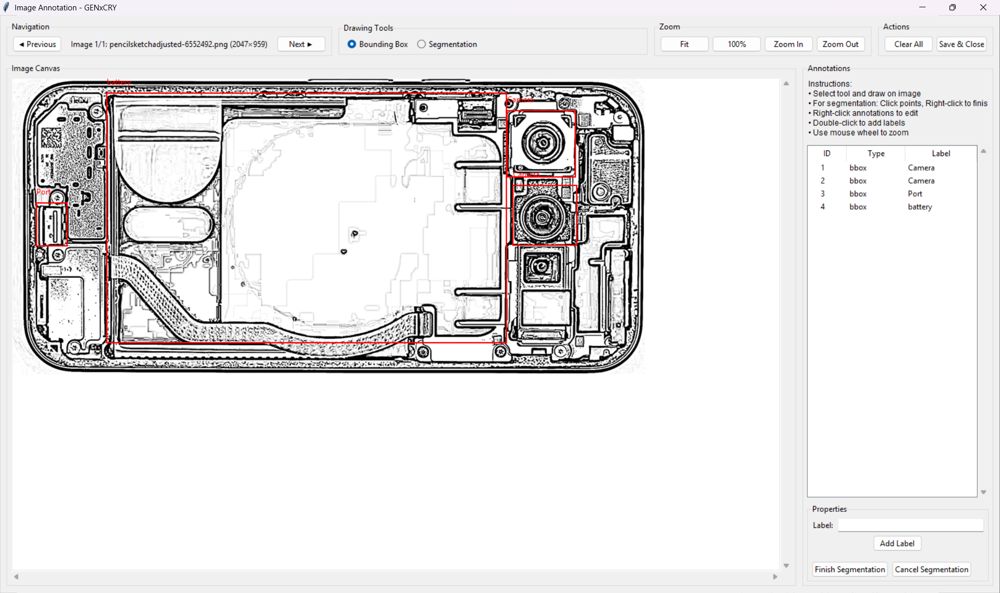
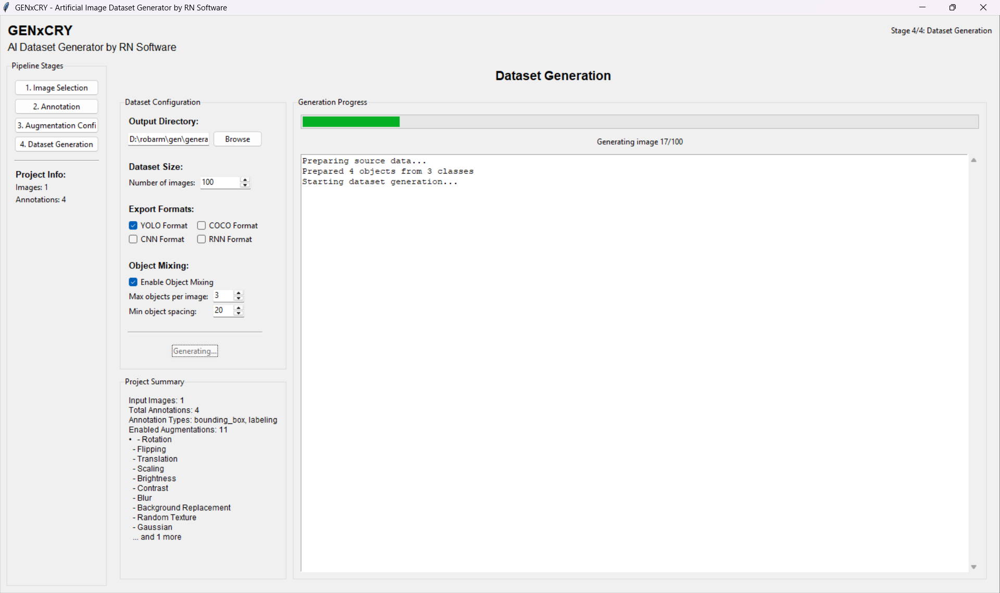
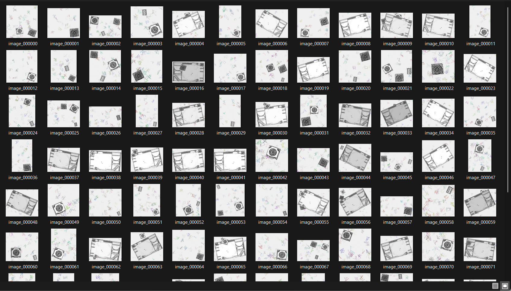

# GENxCRY - Augmented Image Dataset Generator

**By RN Software**

Generate artificial images from a small amount of input images with advanced annotation and augmentation capabilities.

## Key Features

### 🎯 Annotation Tools
- **Bounding Box Annotation**: Draw rectangles around objects
- **Labeling Annotation**: Add text labels to objects
- **Segmentation Annotation**: Freestyle pen drawing for precise object boundaries

### 📊 Dataset Export Formats
- YOLO format
- COCO format
- CNN format
- RNN format

### 🔄 Advanced Augmentation Pipeline
- **Geometric Variations**: Rotation, flipping, shearing, translation, scaling
- **Visual Effects**: Brightness, contrast adjustments
- **Image Effects**: Blurring, shadows, lighting, glare, reflections
- **Background Noise**: Custom backgrounds, random textures, salt & pepper noise, Gaussian noise, scribbled/cluttered backgrounds

### 🎲 Smart Object Mixing
- Randomly mix objects from different input images
- Intelligent positioning to ensure visibility
- Configurable object density and spacing

## Installation

1. Clone this repository
2. Install dependencies:
```bash
pip install -r requirements.txt
```

## Usage

1. Run the application:
```bash
python main.py
```

2. Follow the pipeline:
   - Select input images
   - Choose annotation types
   - Annotate objects in each image
   - Select augmentation options
   - Configure dataset size and export format
   - Generate your dataset!

## 📺 Video Demo

[](https://www.youtube.com/watch?v=0V1UEjBTAnk)

## 📸 Screenshots

### 1. Main Interface - Image Selection & Annotation Types

*Clean and intuitive main interface showing the pipeline stages and annotation type selection*

### 2. Image Browser - Loading Input Images  

*Browse and select images from your local system with thumbnail preview*

### 3. Advanced Annotation Tools

*Professional annotation interface with bounding box, labeling, and segmentation tools for precise object marking*

### 4. Dataset Generation Progress

*Real-time progress tracking during dataset generation with configuration options and augmentation settings*

### 5. Generated Dataset Results

*Gallery view of the generated augmented dataset showing various transformations and object combinations*

## Pipeline Stages

1. **Image Selection**: Choose images from your local system
2. **Annotation**: Draw bounding boxes, segments, and add labels
3. **Augmentation Configuration**: Select desired variations
4. **Dataset Generation**: Specify output size and format

## Requirements

- Python 3.8+
- OpenCV
- scikit-image

## Project Structure

```
GENxCRY/
├── main.py                 # Application entry point
├── requirements.txt        # Python dependencies
├── run.bat                # Windows startup script
├── run.sh                 # Linux/Mac startup script
├── gui/                   # User interface modules
│   ├── main_window.py     # Main application window
│   ├── image_selection.py # Image selection interface
│   ├── annotation_window.py # Annotation tools
│   ├── augmentation_config.py # Augmentation settings
│   └── dataset_generation.py # Generation interface
├── core/                  # Core functionality
│   ├── dataset_generator.py # Main generation engine
│   ├── augmentation_engine.py # Image augmentation
│   └── export_formats.py # Format exporters
├── examples/              # Documentation and examples
│   └── sample_workflow.md # Step-by-step guide
└── LICENSE               # MIT License
```


## Contributing

1. Fork the repository
2. Create a feature branch
3. Make your changes
4. Add tests if applicable
5. Submit a pull request

## Support

For issues and questions:
- Create an issue on GitHub
- Contact: RN Software

## License

MIT License - see LICENSE file for details.

Created by RN with ❤️ for the Dev community.
